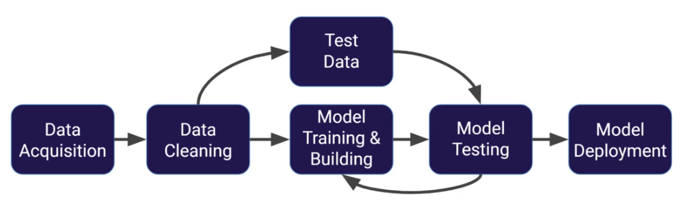
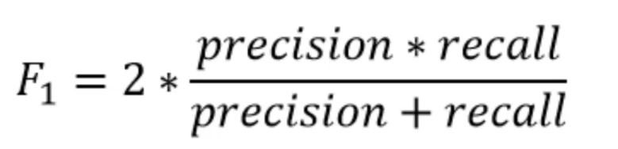
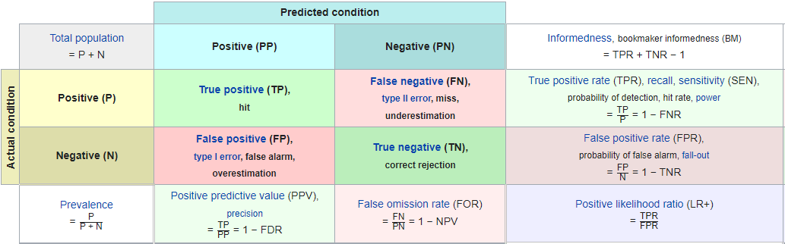
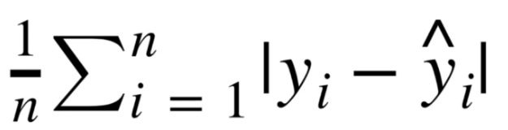
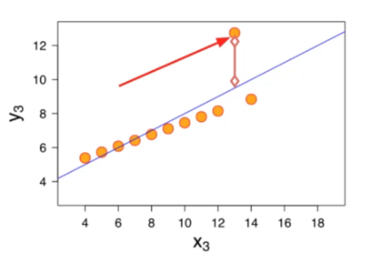
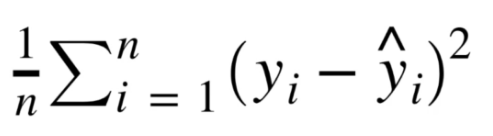
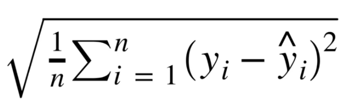

# Supervised Learning
Supervised learning algorithms are trained using labeled examples, such as an input where the desired output is known. Someone has already gone through a labeled the data

For example, a segment of text could have a category label scha s:
+ **Spam** vs **Legitimate** Email
+ **Positive** vs **Negative** Movie Review

The network recieves a set of inputs along with the corresponding correct outputs, and the algorithm learns by comparing its actual output with correct outputs to find errors.

It then modifies the model accordingly.

Supervised learning is commonly used in applications where historical data predicts likely future events.

## Model Evaluation For Classification Errors

### Accuracy
Accuracy in classification problems is the **number of correct predictions** made by the model divided by the **total number of predictions**.

It is usefull when the target classes are well balanced. For example having roughly the same amount of dog and cat images in a network that tries to recognizse an image.

Not good for unbalanced classes. Model would get unbalanced accuracy. We use **Recall** and **Precision** in this situation.

#### Recall and Precision
Recall is the ability of a model to find all the relevant cases within a dataset. It is the number of true positives divided by the number of true positives plus the number of false negatives.

Precision is the ability of a classification model to identify only the relevant data points. It is the number of true positives divided by thr number of true positives plus the number of false positives.

Often theere is a trade-off between Recall and Precision.

While recall expresses the ability to find all relevant instances in a dataset,  precision expresses the proportion of the data points our model says was relevent actually were relevant.

##### F1-Score
In cases where we want to find an optimal blend of precision and recall we can combine the two metrics using what is called the F1Score. It is the harmonic mean of precision and recall taking in both metrics into account in the following equation:

We use the harmonic mean instead of  simple average because it punishes extreme values. A classifier with a precision of 1.0 and a recall of 0.0 has a simple average of 0.5, but an F1 score of 0.

#### Confusion Matrix

#### What is Good Accuracy?
What is considered good accuracy depends on the context of your situation.

Often we have a precision/recall trade off, we need to decide if the model should focus on fixing false positives vs false negatives. 

In disease diagnosis, it is probably better to go in the direction of alse positives, so we make sure we correctly classify as many cases of disease as possible! We want to minimize false negatives!

## Evalutating Regression Error
The most common evaluation Metrics for regression are:
+ Mean Absolute Error
    
    + MAE won't punish large errors
        
+ Mean Squared Error
    
    + Larger errors are noted more than with MAE
    + Units get squared also
+ Root Mean Square Error
    
    + Larger errors are noted more than MAE
    + Doesn't change the units unlike MSE

Compare your error metric to the average value of the label in your data set to try to get an intuiton of its overall performance. Domain knowledge also plays an important role here!